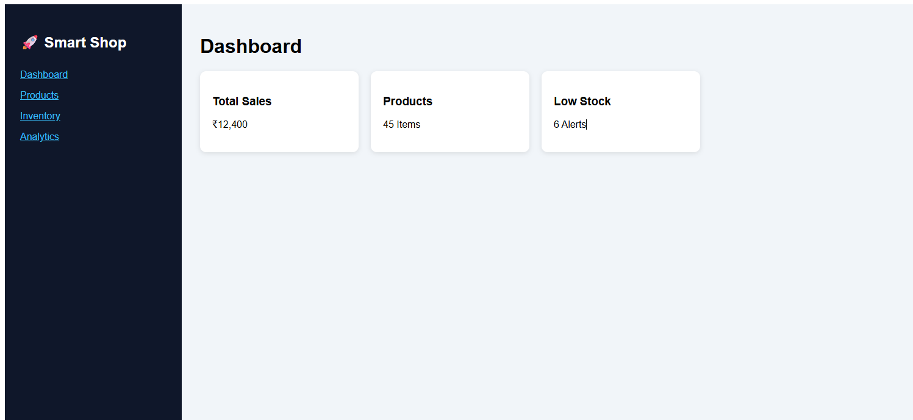

# 🛒 Smart Shop Management System

A smart shop management web application designed to help small business owners manage inventory, pricing, and sales securely — even when operated by temporary staff.

The system focuses on **real-time analytics**, **role-based access**, and **decision support tools** to improve operational efficiency and prevent revenue loss.

---

## 🚀 Features

✅ Role-based access control for financial security  
✅ Real-time profit and margin calculation  
✅ Inventory tracking and low-stock alerts  
✅ Interactive analytics dashboard with KPI cards  
✅ Sales monitoring and reporting system  
✅ Secure pricing visibility for staff management  

---

## 🧠 Problem Statement

Many small shop owners face operational issues when they are away and temporary staff manage the store. Lack of visibility into pricing, inventory, and profit margins can lead to losses.

This project provides:

- Smart monitoring tools
- Automated calculations
- Controlled financial access

---

## 🛠️ Tech Stack

- C Programming
- HTML
- CSS
- Web Application Architecture
- Git & GitHub

---

## 📊 System Workflow

1. User login with role permissions
2. Add or update products
3. Track inventory automatically
4. Calculate sales and profit in real time
5. Dashboard visualization for decisions

---

## 💻 Installation

Clone repository:https://github.com/Aryan11-05/SmartShop.git

Run using your preferred local server or compiler.

---

## 📷 Screenshots

---

## 🎯 Future Improvements

- AI-based demand prediction
- Sales forecasting using Machine Learning
- Automated reorder system
- Mobile responsive UI

---

## 👨‍💻 Author

Aryan  
Computer Science Engineering (AI & ML)

LinkedIn:
https://www.linkedin.com/in/aryan-a11318289

GitHub:
https://github.com/Aryan11-05

---

⭐ If you found this project useful, consider giving it a star!